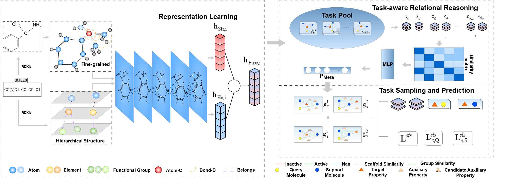

# Few-Shot Molecular Property Prediction via Fine-Grained and Hierarchical Structure Representation Learning

This repository is the implementation of FGHS (Few-Shot Molecular Property Prediction via Fine-Grained and Hierarchical Structure Representation Learning).

## Framework

 


## Environment

To run the code successfully, the following dependencies need to be installed:

```
python           3.9
numpy            1.26.4  
pandas           2.3.3 
torch            2.3.1
torch_geometric  2.6.1
torch_scatter    2.1.2
torch-sparse     0.6.18
torch-cluster    1.6.3
torchvision      0.18.1
tqdm             4.67.1 
rdkit            2023.3.2
```

## Implementation

## Datasets

FGHS is evaluated on three widely used public molecular property prediction benchmarks:

- **Tox21**: a toxicity prediction benchmark containing 12 classification tasks.
- **SIDER**: a side-effect prediction benchmark with 27 tasks.
- **MUV**: a challenging benchmark with 17 highly imbalanced tasks.

All datasets are publicly available and can be obtained from MoleculeNet or other public chemical ML repositories.
Due to licensing and storage considerations, we do not redistribute the datasets in this repository.
Users are expected to download and preprocess the datasets by themselves.


### Usage

Under the 10-shot setting:

```sh
python run.py --dataset {dataset} --n_support 10 --train_auxi_task_num {num} --test_auxi_task_num {num}
```

Under the 1-shot setting:

```sh
python run.py --dataset {dataset} --n_support 1 --train_auxi_task_num {num} --test_auxi_task_num {num}
```
